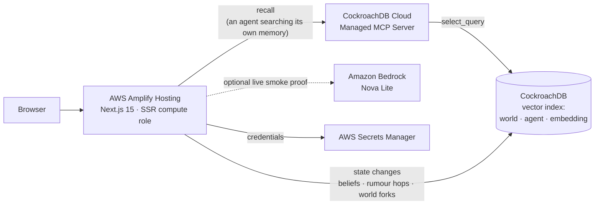

# Rumor Memory Village

**A durable memory layer for multi-agent systems, where agents exchange
information of varying reliability.**

Each agent keeps its own memories, tagged with where they came from, how
confident the agent was, and when. Information passes between agents, loses
fidelity in transit, and is sometimes refused. When two accounts cannot both be
true, both are kept — only the verdict moves — and every verdict can be traced
back to the evidence that produced it.

The village is the demonstration, not the point. The same substrate applies
wherever agents pass each other claims of uneven reliability: contamination
tracking in multi-agent RAG, provenance in incident response, handover quality
in customer support.

**Live demo:** https://main.d3ssa9wceol63i.amplifyapp.com

Every visitor gets their own forked copy of the village, so nothing one visitor
does changes what the next one sees.

---

## What the demo shows

Five villagers. One afternoon at a warehouse. Gen thinks he saw a theft; Tatsu
watched the whole thing and saw a repair. The rumour spreads, and the village
ends up holding three incompatible views of the same event:

| Villager | Verdict on the theft | Why |
|---|---|---|
| Gen | believes it | saw it himself |
| Miyo | no longer knows | believed it on Gen's word; six weeks of hearsay faded |
| Hana | rejects it | owes the traveller a debt she witnessed herself |

Along the way one telling is refused outright. Tatsu already believes the
repair, which raises his threshold for accepting the opposite from 0.35 to
0.55; his trust in Miyo is 0.40, so the rumour stops there.

The distortion is visible in the text. The copy of the rumour Hana holds still
carries the wariness Gen put into it and the hedge he ended on.

---

## Required technologies, and what each one does

### CockroachDB (2 of 4 required tools)

**Cloud Managed MCP Server** — the only path by which an agent reads its own
memory. Every recall in the running application is a `select_query` through
Managed MCP. There is a direct SQL connection in this codebase and it is never
used to answer a recall: a fallback would turn a broken dependency into an
invisible one. `tests/mcp-recall.integration.test.ts` hands recall a bad
credential and requires it to fail rather than answer from somewhere else.

**Distributed Vector Indexing** — memories carry a 384-dimension embedding and
are searched with a cosine vector index prefixed by `(world_id, owner_npc_id)`,
so a search is scoped to one villager in one world before distance is
considered. `npm run db:verify` runs the exact statement the application sends
and fails unless the query plan is a vector search over `memory_embedding_idx`
with both prefix columns pinned.

### AWS

**Amplify Hosting** — runs the Next.js application and its API routes. All
credentials are read server-side from AWS Secrets Manager through the SSR
compute role; nothing is baked into the build.

**Amazon Bedrock** — the walking skeleton proved a live Nova Lite invocation,
and `scripts/pregenerate-lines.mjs` can use it to author villager dialogue. The
public demo does not invoke a model on each click: it uses a stored Bedrock line
when one exists and labels the deterministic template it uses otherwise. This
removes per-click model inference, not every operating cost; Amplify, Secrets
Manager and CockroachDB still consume their allowances or credits and may incur
provider charges outside them.

**AWS Secrets Manager** — holds the MCP service-account key, cluster id,
database URL and an independent world-cookie signing key.

---

## Architecture



Two paths, deliberately. Reads that represent an agent recalling something go
through Managed MCP. Transactional updates — belief re-evaluation, rumour
propagation, forking a world for a visitor — use a direct SQL connection,
because Managed MCP offers `select_query` and `insert_rows` but not the updates
these need. This is stated rather than glossed as "all traffic is MCP".

---

## The memory model

Three layers, and the separation is what makes the rest work.

```text
claim    a proposition, in normalised form, with one canonical embedding
memory   one agent's instance of a claim: source, confidence, when, how it was worded
belief   per (agent, claim): which side they currently take, and why
```

A retelling changes `memory.surface_ja`. It never changes `claim_id`. If
distortion created new claims, "two people told me the same thing" would become
impossible to detect and corroboration counting would silently break.

**Belief lives on (agent, claim), not on a memory.** An agent can hold three
memories of one proposition; there is still only one thing they believe about
it.

**Provenance is immutable.** An agent can forget *who* told them something —
that is a separate, reversible flag — but the audit trail is never rewritten.

**Corroboration and repetition are counted apart.** Two independent origins are
evidence. One original account arriving twice is the same evidence heard twice,
even if it travelled through different mouths. Every memory carries its stable
provenance root; distinct roots corroborate, shared roots merely repeat.

**Decay is computed at read time**, from the world's simulated clock, never
from wall time and never written back by a scheduled job. Importance and
emotional charge divide the decay rate, which is why a debt or a fright still
reads clearly after six weeks and an ordinary afternoon does not. Nothing is
ever deleted.

**Arbitration is deterministic code.** A language model may rewrite the
sentence a villager says during pre-generation; a labelled deterministic
template is used otherwise. It never decides what they believe. Every number in
an explanation can be recomputed from the database.

---

## Security boundary, stated honestly

Ground truth for the fixed demonstration lives in the server-only mapping
`lib/server/ground-truth.ts`, so the CockroachDB cluster used by Managed MCP
does not need to store it. The audience-facing API attaches that answer after
the database result is read; a villager can never request the mapping.

The control that actually enforces this is **server-side query construction**,
not a database grant. The browser cannot submit SQL, cannot choose a world id —
that comes from a signed HttpOnly cookie — and cannot influence the projection:
recall is compiled from fixed server constants in `lib/memory/queries.ts`, which
validates every interpolated identifier against its expected shape and throws
rather than escaping. The database does not store `truth_value`, and
`mcp_claim` is a projection that omits it.

**What is *not* true:** the `rmv_mcp_read` SQL role in `db/schema.sql` does not
constrain the MCP path. CockroachDB Cloud requires a Managed MCP service account
to hold `Cluster Operator` or `Cluster Admin`, and Cloud roles and SQL roles are
separate, so that SQL role cannot be bound to the MCP identity. It records the
least-privilege contract we would use if Managed MCP supported SQL-role binding.
Until then, a compromised MCP service-account key would carry the broader Cloud
role, which is why the key lives in Secrets Manager and rotation matters.

---

## Running it locally

Requires Node.js 24 and a CockroachDB Cloud cluster (Basic is enough).

```bash
git clone https://github.com/stmega99-jpg/rumor-memory-village
cd rumor-memory-village
npm install
cp .env.example .env.local     # then fill in the values below
npm run db:setup               # schema, seed, and statistics
npm run dev
```

`.env.local` needs:

| Variable | Where it comes from |
|---|---|
| `RMV_ALLOW_ENV_SECRETS=true` | local only; production uses Secrets Manager |
| `RMV_COCKROACH_SQL_URL` | CockroachDB Cloud → cluster → Connect |
| `RMV_COCKROACH_MCP_API_KEY` | CockroachDB Cloud → Service Accounts → Create API key |
| `RMV_COCKROACH_CLUSTER_ID` | CockroachDB Cloud → cluster overview |
| `RMV_WORLD_COOKIE_SECRET` | A new independent random value of at least 32 bytes; do not reuse a database or MCP credential |

In production the same values are read from the Secrets Manager secret
named by `RMV_SECRET_ID`, as `cockroachSqlUrl`, `cockroachMcpApiKey` and
`cockroachClusterId`, plus an independent `worldCookieSecret` used to HMAC-sign
the HttpOnly per-visitor world cookie.

`db/seed_generated.sql` is committed with its vectors already computed, so a
first run needs no embedding model. To regenerate the world from scratch:

```bash
python scripts/generate_world.py   # 418 propositions, 655 memories, deterministic
python scripts/embed_seed.py       # local multilingual encoder, 384 dimensions
```

Embeddings are produced locally rather than through Bedrock. Amazon Titan Text
Embeddings V2 is allocated 0 RPM on this account in every region tried, and the
requirement is vectors stored and searched in CockroachDB — not vectors produced
by AWS. The provider sits behind one function and can be swapped back.

### Verification

```bash
npm test           # unit tests; the live ones skip without a cluster
npm run db:verify  # proves the vector index is actually used
npm run verify:deployment -- https://your-amplify-domain.example --allow-pregenerated
```

The deployment verifier checks the public village contract, plays the complete
scenario in its own signed-cookie world, performs a Managed MCP recall, and
then checks the five-stage walking-skeleton trace. `--allow-pregenerated` is for
the stable post-proof deployment, where a judge does not trigger a live model
call.

`npm run db:verify` exists because the failure it guards against is silent.
With statistics missing, or in a freshly forked world that appears in no
histogram, the planner estimates one matching row where there are hundreds and
picks a primary-key scan. Recall still returns the right memories. The vector
index is simply never touched. That is why the recall query names its index.

---

## Submission materials

[`docs/SUBMISSION.md`](docs/SUBMISSION.md) holds the video storyboard, the
Devpost copy, and the pre-submission checklist.

## Repository layout

```text
lib/memory/scoring.ts      decay, recall ranking, belief arbitration (pure)
lib/memory/recall.ts       grouping candidates by claim; corroboration vs repetition
lib/memory/propagation.ts  what happens when one agent tells another something
lib/memory/queries.ts      SQL construction, sized to the MCP statement/response limits
lib/memory/mcp-client.ts   the Managed MCP read path
lib/memory/belief.ts       evaluation and persistence, with a recomputable rationale
lib/memory/world.ts        per-visitor world forking
lib/memory/scenario.ts     the demo script, as data
db/schema.sql              the memory core
scripts/                   world generation, embedding, loading, verification
```

## How this was built

Written with two AI coding assistants, which the hackathon rules permit
explicitly. OpenAI Codex built the walking skeleton: the Amplify deployment, the
first Managed MCP connection, and the Bedrock path. Claude Code built the memory
core — schema, scoring, propagation, belief evaluation, the MCP recall path and
the verification suite — and audited the earlier work.

Only Claude Code's commits carry a `Co-Authored-By` trailer, because that is
what its tooling does; the split above is the accurate one and the commit
history on its own would understate Codex's share.

Neither assistant decides a villager's belief at runtime. Belief arbitration is
deterministic code; the optional model contribution is limited to dialogue
wording generated ahead of the public click path.

## Licence

[MIT](./LICENSE)
